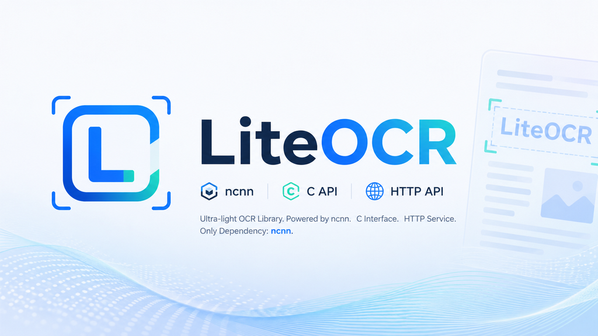

<p align="center">
  
</p>

<h1 align="center">LiteOCR</h1>

<p align="center">
  基于 <a href="https://github.com/Tencent/ncnn">ncnn</a> 的轻量级 OCR 推理库，支持 C/C++ 与 Python，可在 Windows / Linux / macOS 上快速部署。
</p>

<p align="center">
  <a href="LICENSE"></a>
  
  
  <a href="https://github.com/futz12/LiteOCR/actions"></a>
</p>

---

## ✨ 特性

- 🚀 **轻量高效**：基于 ncnn，无重型深度学习框架依赖，推理速度快、内存占用低。
- 🖥️ **跨平台**：支持 Windows、Linux 与 macOS。
- 🔌 **多语言接口**：提供 C API 与 Python 绑定，方便接入 C/C++、Python 项目。
- 📦 **即装即用**：`pip install .` 自动构建并打包原生动态库，开箱即用。
- 🔧 **模型覆盖**：内置 PaddleOCR 检测/识别、文本行方向、文档方向、UVDoc 畸变校正、表格识别等 pipeline。
- 🎛️ **灵活构建**：支持 bundled ncnn 或系统 ncnn，可选 Vulkan GPU 加速。

---

## 📋 Pipeline 进度

| 模块 | 状态 |
|------|------|
| PaddleOCR 检测 (Det) | ✅ |
| PaddleOCR 识别 (Rec) | ✅ |
| 文本行方向 (Textline ORI) | ✅ |
| 文档方向 (DOC ORI) | ✅ |
| UVDoc 畸变校正 | ✅ |
| 表格识别 (TableRec) | ✅ |
| 版面分析 (Layout) | ⏳ |
| LaTeX OCR | ⏳ |

## 📝 TODO

- [ ] PaddleOCR 完整端到端 Pipeline
- [ ] HTTP API 服务
- [ ] 更多语言支持

---

## 🚀 快速开始

### 1. 克隆仓库并初始化子模块

```bash
git clone https://github.com/futz12/LiteOCR.git
cd LiteOCR
git submodule update --init --recursive
```

### 2. C++ 构建

```bash
cmake -S . -B build -DCMAKE_BUILD_TYPE=Release
cmake --build build --config Release --parallel
```

Windows 使用 Visual Studio 生成器时，可执行文件默认位于 `build/Release/`。

如需启用 Vulkan GPU 加速：

```bash
cmake -S . -B build -DCMAKE_BUILD_TYPE=Release -DLITEOCR_ENABLE_VULKAN=ON
```

> 详细构建选项请参考 [docs/build.md](docs/build.md)。

### 3. 下载模型

模型文件不随仓库分发，需从镜像下载到 `models/` 目录：

```
https://mirrors.sdu.edu.cn/ncnn_modelzoo/liteocr/
```

Python 用户在加载预设时会自动下载；C/C++ 用户需手动下载。详见 [`models/README.md`](models/README.md)。

### 4. Python 安装

```bash
pip install .
```

安装完成后验证：

```bash
python -m liteocr
```

如需开发测试依赖：

```bash
pip install .[dev]
pytest python/tests/test_basic.py -v
```

> Python API 详情参考 [docs/python.md](docs/python.md)。

---

## 📂 模型与示例

- 预训练模型文件**不随仓库分发**，需从镜像 [`https://mirrors.sdu.edu.cn/ncnn_modelzoo/liteocr/`](https://mirrors.sdu.edu.cn/ncnn_modelzoo/liteocr/) 下载到 [`models/`](models/) 目录，下载说明见 [`models/README.md`](models/README.md)。
- C++ 示例位于 [`examples/`](examples/)。
- Python 可运行示例位于 [`examples/python/`](examples/python/)。
- API 使用示例请参考 [docs/examples.md](docs/examples.md)。

---

## 📚 文档

| 文档 | 说明 |
|------|------|
| [docs/build.md](docs/build.md) | CMake / Python wheel 构建说明 |
| [docs/python.md](docs/python.md) | Python API 文档 |
| [docs/c-api.md](docs/c-api.md) | C API 文档 |
| [docs/examples.md](docs/examples.md) | 使用示例 |
| [docs/performance.md](docs/performance.md) | 性能数据 |

---

## 📄 许可证

本项目基于 [Apache License 2.0](LICENSE) 开源。
